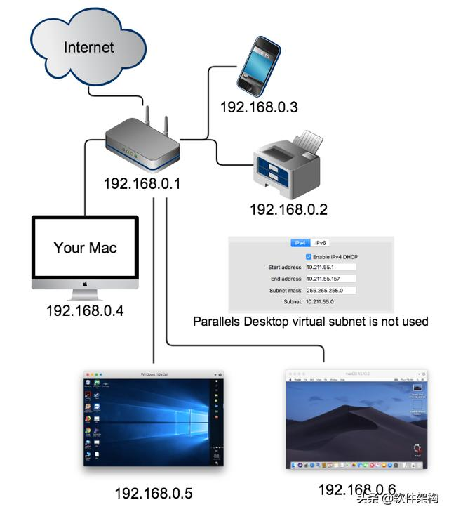
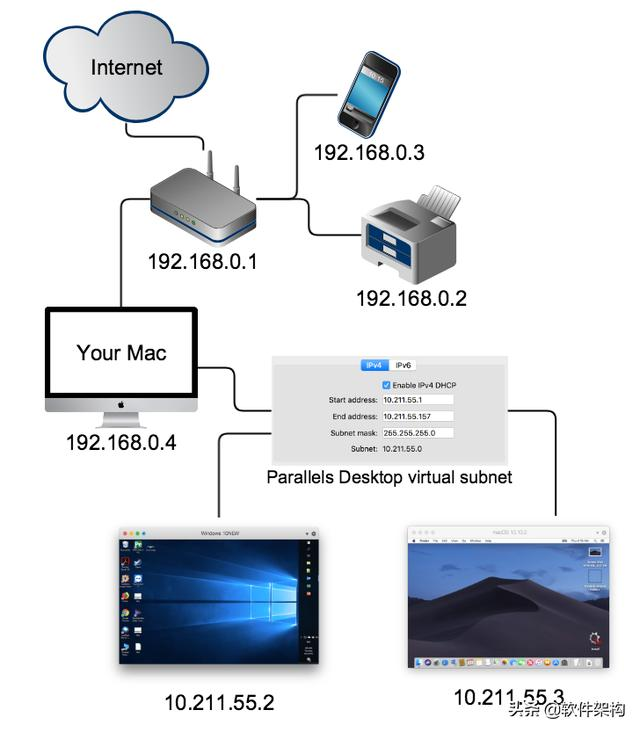

# video_stream_DDS
This is a demo of real-time video transmission through Fast DDS, which have been test on ubuntu20.04. The effect of this demo is to acquire the image from the camera and transmit it through dds, and then display it.

This demo is modified based on 
server/client of [opencv_tcp_udp_video_test](https://github.com/mengchaoheng/opencv_tcp_udp_video_test.git) and [publish/subscribe](https://fast-dds.docs.eprosima.com/en/latest/fastddsgen/pubsub_app/pubsub_app.html#) 
of docs of Fast DDS-Gen, and the configuration of DDS also refers to [SampleConfig_Multimedia](https://github.com/eProsima/Fast-DDS/tree/master/examples/cpp/dds/SampleConfig_Multimedia), which is the examples of Fast-DDS.

```
Note:
As a DDS application examples, Audio and Video transmission have a common characteristic: Having a stable, high datarate feed is more important than 
having a 100% lossless transmission:

- Reliability: Best-Effort. We want to have a fast transmission. If a sample is lost, it can be recovered via error-correcting algorithms.

- Durability: Volatile. We do not mind data from the past, we want to stream what is happening in the present.

- History: Keep-Last with Low Depth. Once displayed or recorded on the receiving application, they are not needed in the History.

- note: In the case of video, depth can be as low as 1. A missing sample of a 50 frames per second stream represents virtually no information loss. 
```

#  Prerequisites
- install [opencv4.7.0](https://docs.opencv.org/4.7.0/d7/d9f/tutorial_linux_install.html)

- install [fast DDS and Fast DDS-Gen](https://fast-dds.docs.eprosima.com/en/latest/installation/sources/sources_linux.html#cmake-installation), note that CMake installation locally is good. 

# build
cd to `video_stream_DDS/build` path and:
```
$ cmake .. && cmake --build . -j8
```
If need to update idl file, cd to `video_stream_DDS/src` and run:
```
fastddsgen -replace HelloWorld.idl
```
# run 

## LAN

In build path, run
```
./DDSHelloWorldSubscriber
```
Open another terminal, which can be another computer in the same LAN, run cd to `video_stream_DDS/build` and then run:
```
./DDSHelloWorldPublisher
```
## WAN
In order to explain my scenario I use a parallels virtual machine for illustration, his virtual machine network has [Bridged Network and Shared Networking](https://kb.parallels.com/4948) mode, when I set up two virtual machines working in these two modes to use dds router to communicate,.

1.Computer IP:192.168.0.4

2.one vm is Bridged Network, note as PC1, bridged network, and IP is 192.168.0.5



3.another vm PC2 is Shared networking, and IP is 10.211.55.2



The communication between PC1 and PC2 belongs to WAN communication, and port mapping is required so that the public ip can access the private ip. A simple understanding is that port mapping needs to be traversed until the two PCs can be in the same subnet and can access each other. What is special here is that PC2 can access PC1, but PC1 cannot access PC2 (private ip). So you only need to do port mapping on PC2 to access the private ip. Here the port mapping is set to:
Map PC2's wan ip 192.168.0.4 port 11666 to PC2's lan ip 10.211.55.2


On PC1, the wan_client.yaml is:
```Console
version: v3.0                                                     

participants:

  - name: SimpleParticipant                                      
    kind: local                                                   
    domain: 0                                                     

  - name: WanParticipant                                          
    kind: wan                                                     
    connection-addresses:                                        
      - ip: 192.168.0.4
        port: 11666
        transport: udp
```
On PC2, the wan_server.yaml is:
```Console
version: v3.0                                                    

participants:

  - name: SimpleParticipant                                       
    kind: local                                                  
    domain: 1                                                    

  - name: WanParticipant                                          
    kind: wan                                                     
    listening-addresses:
      - ip: 192.168.0.4                                             
        port: 11666                                               
        transport: udp                                            
```

1. On PC1, cd to `video_stream_DDS/src/ddsrouter_config` then run 
```
ddsrouter -c wan_client.yaml
```
and on the new terminal, cd to `video_stream_DDS/build` and then run:
```
./DDSHelloWorldPublisher
```


2. On PC1, cd to `video_stream_DDS/src/ddsrouter_config` then run 
```
ddsrouter -c wan_server.yaml
```
and on the new terminal, cd to `video_stream_DDS/build` and then run:
```
./DDSHelloWorldSubscriber
```